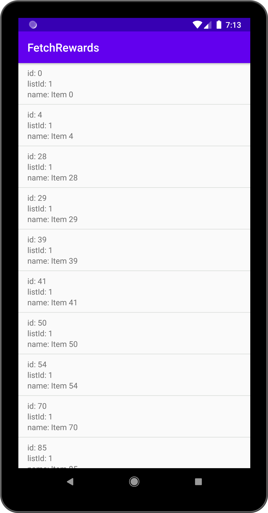

# FetchRewards

A simple app written using Kotlin and MVVM design pattern. The app stores the items retrieved from a remote source into the local database and shows them in a list using Paging library 2. 
When items are stored, the number is parsed from the name and stored in a new column in the table. When items are retrieved from the database they are sorted by listId and nameNumber.
The app shows loading state and error messages for failed network requests or failed database queries.

## Libraries

- Dagger 2
- Retrofit
- Room
- Paging 2
- RxJava 2
- Picasso
- JUnit

## Testing

The project contains  [Local unit tests][2] and [Instrumented tests][3].

Just run `./gradlew test` or `./gradlew connectedAndroidTest`

## Screenshots

[2]: app/src/test/java/com/example/fetchrewards/
[3]: app/src/androidTest/java/com/example/fetchrewards/
